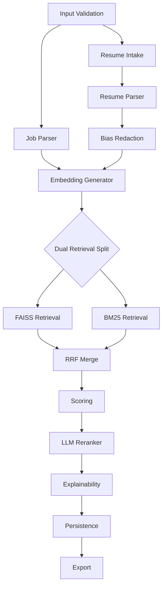

# TalentMind AI - Backend Architecture

This document captures the complete backend architecture for TalentMind AI. It is a design-only deliverable — no implementation code is included.

## 1. Repository Structure

```
ai_recruter/
├── backend/
│   ├── app/
│   │   ├── api/                   # FastAPI routers and API contracts
│   │   ├── core/                  # Config, settings, startup/shutdown
│   │   ├── schemas/               # Pydantic request/response schemas
│   │   ├── models/                # Pydantic/SQLModel schemas
│   │   ├── repositories/          # DB access and persistence adapters
│   │   ├── db/                    # Database session, migrations, repos
│   │   ├── services/              # Business logic (parsing, embeddings, scoring)
│   │   ├── agents/                # LangGraph agents/workflow wrappers
│   │   ├── ai/                    # Model wrappers and prompts
│   │   ├── retrieval/             # FAISS, BM25, RRF implementations
│   │   ├── parsers/               # Resume & Job parsers (Docling wrappers)
│   │   ├── scoring/               # Multi-factor scoring engine
│   │   ├── explainability/        # Explainability output generators
│   │   ├── auth/                  # JWT, auth utilities
│   │   ├── storage/               # File storage handling (local/S3)
│   │   ├── monitoring/            # Tracing, metrics, alerting hooks
│   │   ├── governance/            # PII, retention, audit-log utilities
│   │   ├── interfaces/            # Typed contracts for services/repositories
│   │   ├── vector_store/          # Storage-agnostic vector store abstraction
│   │   ├── workers/               # Background task stubs
│   │   ├── utils/                 # Small helpers, logging, errors
│   │   └── tests/                 # Unit & integration tests for backend
│   ├── Dockerfile
│   ├── requirements.txt
│   └── README.md
├── agents/                       # LangGraph workflows and configs
├── ai_models/                    # Model config, prompts, token limits
├── frontend/                     # Next.js dashboard (separate repository in prod)
├── infra/                        # Docker-compose, Terraform, k8s manifests
├── data/                         # Local datasets, sample resumes, test JDs
├── scripts/                      # Dev scripts (index rebuilding, migrations)
├── docs/                         # Design docs, architecture, API spec
├── notebooks/                    # Experiments and evaluation notebooks
└── tests/                        # End-to-end tests & evaluation suites

```

Responsibilities:
- `backend/app/api`: Defines REST endpoints, validation, and response schemas.
- `backend/app/core`: Application configuration (`Settings` via Pydantic), logging setup, dependency injection, startup tasks (load indices).
- `backend/app/schemas`: Pydantic request/response models shared across routes and services.
- `backend/app/models`: Domain models: `Candidate`, `Resume`, `JobDescription`, `Embedding`, `RankingResult` (SQLModel definitions go here).
- `backend/app/repositories`: Data access layer for persistence, query composition, and transaction boundaries.
- `backend/app/db`: Database engine, session, repository layer, migrations.
- `backend/app/services`: Implementation of high-level operations orchestrating parsers, embeddings, retrievers, scoring, and explainability.
- `backend/app/agents`: LangGraph glue code to define and trigger multi-step AI workflows.
- `backend/app/ai`: Model wrappers, prompt templates, retry & rate-limit logic.
- `backend/app/retrieval`: FAISS/BM25 index management, hybrid retrieval orchestration, RRF merging.
- `backend/app/parsers`: Resume & JD parsing utilities; conversion to structured JSON.
- `backend/app/scoring`: Multi-factor scoring computation and weighting configuration.
- `backend/app/explainability`: Structured explainability builder and templates.
- `backend/app/auth`: JWT creation/validation, API key handling.
- `backend/app/storage`: File upload handling and virus-scan/sanitization.
- `backend/app/monitoring`: Tracing, metrics, and health signal integration.
- `backend/app/governance`: PII redaction, retention rules, and audit-log helpers.
- `backend/app/interfaces`: Protocols and contracts to decouple services from implementations.
- `backend/app/vector_store`: Storage-agnostic vector store adapters and abstractions.
- `backend/app/workers`: Asynchronous task stubs for parsing, embedding, and indexing jobs.
- `backend/app/utils`: Common utilities: backoff, exceptions, metrics, schemas.
- `agents/`: LangGraph workflow definitions and node configs (separate from runtime wrappers).
- `ai_models/`: Model meta configs: model name, token limits, cost estimates, input/output formats.

## 2. System Architecture - Module Details

Each module below describes purpose, inputs, outputs, dependencies, internal workflow, and failure handling.

### 2.1 API Layer (`backend/app/api`)
- Purpose: Expose REST endpoints for JD parsing, resume upload, ranking, retrieval, and exports.
- Inputs: HTTP requests (JSON, multipart/form-data for files).
- Outputs: JSON responses, CSV/PDF downloads.
- Dependencies: `services`, `auth`, `models`.
- Internal workflow: Validate request -> auth check -> delegate to service -> format response.
- Failure handling: Return structured errors (400, 401, 404, 422, 500) with machine-readable error codes; log full stack for 5xx.

### 2.2 Job Understanding Agent (`backend/app/parsers/jd_parser`)
- Purpose: Parse job description text into structured ICP.
- Inputs: raw JD text, optional metadata (company, location)
- Outputs: ICP JSON with `role`, `required_skills`, `preferred_skills`, `experience`, `weights`.
- Dependencies: LLM model, prompt templates.
- Workflow: sanitize input -> call LLM with extraction prompt -> post-process into typed model -> persist ICP.
- Failure: If LLM fails, fallback to heuristic regex-based extraction; return partial ICP and mark confidence low.

### 2.3 Resume Parser Agent (`backend/app/parsers/resume_parser`)
- Purpose: Extract structured candidate profile from PDF/DOCX.
- Inputs: resume file (binary), optional candidate metadata.
- Outputs: `CandidateProfile` JSON (skills, education, projects, companies, timeline).
- Dependencies: OCR (if scanned), Docling or LLM, parsers for docx/pdf.
- Workflow: file sanitization -> convert to text -> OCR if needed -> call parsing pipeline (regex + LLM) -> output normalized fields.
- Failure: On parse failure try OCR; on repeated failure store raw text and return parsing errors with reason.

### 2.4 AI / Embedding Service (`backend/app/ai`)
- Purpose: Generate embeddings and call LLMs for inference tasks.
- Inputs: text payloads, prompt templates
- Outputs: embeddings (vectors), LLM responses
- Dependencies: external model API or local runtime
- Workflow: batching for embeddings -> cache results -> return to caller
- Failure: exponential backoff, circuit breaker, degrade to cached or CPU-only fallback.

### 2.5 Retrieval Layer (`backend/app/retrieval`)
- Purpose: Provide hybrid search combining FAISS and BM25 and merge using RRF.
- Inputs: query embedding, query text, candidate metadata filters
- Outputs: ranked candidate ids with scores
- Dependencies: FAISS index, BM25 index, candidate metadata store
- Workflow: run dense search on FAISS -> run BM25 -> merge ranks using RRF -> apply metadata filters -> return top-K
- Failure: If FAISS unavailable, fall back to BM25-only; if BM25 fails, fallback to FAISS-only.

### 2.6 Scoring Engine (`backend/app/scoring`)
- Purpose: Compute multi-factor scores and final weighted score.
- Inputs: candidate structured profile, ICP, retrieval scores
- Outputs: per-factor scores + final score
- Dependencies: feature calculators (skill coverage, career growth, project quality)
- Workflow: compute features -> normalize to 0-1 -> weighted sum -> attach reasons
- Failure: If feature calculation fails, mark factor as `null` and re-normalize weights across available factors.

### 2.7 Explainability Engine (`backend/app/explainability`)
- Purpose: Produce human-readable rationale for ranking decisions.
- Inputs: scoring breakdown, candidate profile, ICP
- Outputs: JSON explainability report (overall fit, strengths, weaknesses)
- Dependencies: LLM (for natural language rendering), templates
- Workflow: compute deterministic sections (missing skills, coverage), use LLM to generate narrative, return structured JSON
- Failure: On LLM failure, return deterministic fields only and set `confidence` lower.

### 2.8 Bias Checker (`backend/app/utils/bias_checker`)
- Purpose: Remove sensitive attributes and score for bias.
- Inputs: candidate profile
- Outputs: redacted profile and bias metrics
- Dependencies: policy rules
- Workflow: redact fields -> run bias heuristics -> attach flags
- Failure: Always prioritize redaction (never omit redaction on partial failure).

### 2.9 Storage & File Handling (`backend/app/storage`)
- Purpose: Accept, scan, store resumes and attachments.
- Inputs: uploaded files
- Outputs: stored path/URL, scan reports
- Dependencies: antivirus scanner or third-party service
- Workflow: virus-scan -> store in blob storage (S3/local) -> return reference
- Failure: reject files failing scan; support retry for transient storage errors.

### 2.10 Auth & Security (`backend/app/auth`)
- Purpose: JWT issuance/validation, role-based access
- Inputs: credentials or API key
- Outputs: tokens, validated identity
- Dependencies: secrets store, rate limiter
- Workflow: validate credentials -> issue token -> attach claims
- Failure: return 401/403; record failed attempts for rate limiting.

### 2.11 Orchestration / Agents (`backend/app/agents` + `agents/`)
- Purpose: Implement LangGraph workflow nodes, state, retries.
- Inputs: starting event (e.g., JD uploaded)
- Outputs: results from composed steps
- Dependencies: `parsers`, `ai`, `retrieval`, `scoring`
- Workflow: nodes connected per LangGraph; each node returns typed outputs; orchestrator handles retries, timeouts.
- Failure: node-level retries and fail-fast policy for dependent stages.

### 2.12 Monitoring, Logging, Metrics (`backend/app/core/logging`)
- Purpose: Central structured logging, metrics, health checks
- Inputs: application events
- Outputs: logs, metrics (Prometheus), alerts
- Dependencies: logging backend, Prometheus push/gateway
- Workflow: structured logs (JSON), metrics per endpoint and business events
- Failure: degrade gracefully; logs to local disk if remote logging unavailable.

## 3. Database Design (SQLModel)

Below are SQLModel-style models (schema design). These are design-only; adapt indexes and constraints per DB.

```py
from typing import List, Optional
from sqlmodel import SQLModel, Field, Relationship
from datetime import datetime

class Skill(SQLModel, table=True):
    id: Optional[int] = Field(default=None, primary_key=True)
    name: str = Field(index=True)

class JobDescription(SQLModel, table=True):
    id: Optional[int] = Field(default=None, primary_key=True)
    title: str
    company: Optional[str]
    raw_text: str
    created_at: datetime = Field(default_factory=datetime.utcnow)
    icp_json: Optional[str]  # JSON blob of ICP

class Resume(SQLModel, table=True):
    id: Optional[int] = Field(default=None, primary_key=True)
    candidate_id: Optional[int] = Field(index=True)
    original_filename: str
    storage_path: str
    uploaded_at: datetime = Field(default_factory=datetime.utcnow)
    parsed_json: Optional[str]

class Candidate(SQLModel, table=True):
    id: Optional[int] = Field(default=None, primary_key=True)
    first_name: Optional[str]
    last_name: Optional[str]
    email: Optional[str] = Field(index=True)
    profile_json: Optional[str]
    created_at: datetime = Field(default_factory=datetime.utcnow)

class CandidateEmbedding(SQLModel, table=True):
    id: Optional[int] = Field(default=None, primary_key=True)
    candidate_id: int = Field(index=True)
    vector: bytes  # store as binary blob (or use separate vector DB)
    model_name: str
    created_at: datetime = Field(default_factory=datetime.utcnow)

class RankingResult(SQLModel, table=True):
    id: Optional[int] = Field(default=None, primary_key=True)
    job_id: int = Field(index=True)
    candidate_id: int = Field(index=True)
    score: float
    detail_json: Optional[str]  # scoring breakdown + explainability
    created_at: datetime = Field(default_factory=datetime.utcnow)

class Project(SQLModel, table=True):
    id: Optional[int] = Field(default=None, primary_key=True)
    candidate_id: int = Field(index=True)
    title: str
    description: Optional[str]
    start_date: Optional[datetime]
    end_date: Optional[datetime]

class Education(SQLModel, table=True):
    id: Optional[int] = Field(default=None, primary_key=True)
    candidate_id: int = Field(index=True)
    institution: str
    degree: Optional[str]
    start_year: Optional[int]
    end_year: Optional[int]

class Experience(SQLModel, table=True):
    id: Optional[int] = Field(default=None, primary_key=True)
    candidate_id: int = Field(index=True)
    company: str
    title: str
    start_date: Optional[datetime]
    end_date: Optional[datetime]
    responsibilities: Optional[str]

class APILog(SQLModel, table=True):
    id: Optional[int] = Field(default=None, primary_key=True)
    route: str
    method: str
    status_code: int
    request_body: Optional[str]
    response_body: Optional[str]
    created_at: datetime = Field(default_factory=datetime.utcnow)

```

Indexes & Notes:
- Index `candidate_id` on embeddings for fast lookup.
- Consider using a vector DB (Weaviate/Pinecone) for production embeddings instead of binary blobs.

## 4. API Design

The API design focuses on clarity, validation, and reproducible outputs.

### 4.1 API Design Principles

- Versioned routes under `/api/v1`.
- Request/response models live in `backend/app/schemas`.
- All endpoints use explicit validation, typed response envelopes, and structured error payloads.
- Long-running tasks return an `operation_id` and can be polled or streamed when needed.

### 4.2 Common API Envelopes

Request envelope for async operations:

```json
{
  "request_id": "uuid",
  "trace_id": "uuid",
  "payload": {}
}
```

Standard error envelope:

```json
{
  "code": "INVALID_INPUT",
  "message": "Resume file type is not supported.",
  "details": {
    "field": "file",
    "allowed_types": ["application/pdf", "application/vnd.openxmlformats-officedocument.wordprocessingml.document"]
  }
}
```

### 4.3 Endpoint Contracts

#### `POST /api/v1/parse-jd`
- Purpose: Parse job description text into an Ideal Candidate Profile.
- Request schema:
  - `title: str` required
  - `company: Optional[str]`
  - `text: str` required
  - `language: Optional[str] = "en"`
  - `source: Optional[str]` (e.g. `manual`, `ats`, `pdf_text`)
- Response schema:
  - `job_id: int`
    - `icp: JobIdealCandidateProfile`
  - `confidence: float`
  - `extracted_skills: list[str]`
  - `warnings: list[str]`
- Validation:
  - `text` must not be empty.
  - `text` length bounded to avoid LLM overload.
  - `language` must be supported if provided.
- Error handling:
  - `400 INVALID_INPUT` for empty/invalid payloads.
  - `422 VALIDATION_ERROR` for schema violations.
  - `429 RATE_LIMITED` when model usage quota is exceeded.
  - `500 JD_PARSE_FAILED` for unrecoverable parsing failures.

#### `POST /api/v1/upload-resume`
- Purpose: Upload and parse a candidate resume.
- Request schema:
  - multipart field `file` required
  - optional `candidate_id: int`
  - optional `source: str`
- Response schema:
  - `resume_id: int`
  - `candidate_id: int | null`
  - `status: "queued" | "parsed" | "failed"`
  - `parsed_preview: ResumeProfilePreview | null`
  - `operation_id: str | null`
- Validation:
  - Only PDF/DOCX allowed.
  - Enforce maximum file size.
  - Reject suspicious filenames and path traversal attempts.
- Error handling:
  - `400 INVALID_FILE`
  - `413 FILE_TOO_LARGE`
  - `415 UNSUPPORTED_MEDIA_TYPE`
  - `422 VALIDATION_ERROR`
  - `500 RESUME_PARSE_FAILED`

#### `POST /api/v1/rank`
- Purpose: Rank candidates for a given job description.
- Request schema:
  - `job_id: int` required
  - `candidate_ids: list[int] | null`
  - `top_k: int = 20`
  - `include_explainability: bool = true`
  - `filters: CandidateFilterSet | null`
- Response schema:
  - `job_id: int`
  - `rankings: list[RankingResultItem]`
  - `retrieval_summary: RetrievalSummary`
  - `generated_at: datetime`
- Validation:
  - Job must exist.
  - `top_k` must be in safe bounds.
  - Candidate IDs must belong to accessible tenant scope.
- Error handling:
  - `404 JOB_NOT_FOUND`
  - `403 FORBIDDEN` for cross-tenant access violations.
  - `429 RATE_LIMITED`
  - `500 RANKING_FAILED`

#### `GET /api/v1/candidate/{id}`
- Purpose: Retrieve a candidate profile and latest ranking details.
- Response schema:
  - `candidate: CandidateDetail`
  - `resume_summary: ResumeSummary | null`
  - `skills: list[SkillSummary]`
  - `latest_rankings: list[RankingResultItem]`
- Validation:
  - `id` must be a positive integer.
- Error handling:
  - `404 CANDIDATE_NOT_FOUND`
  - `403 FORBIDDEN`

#### `GET /api/v1/dashboard`
- Purpose: Provide dashboard data for recruiter UI.
- Query params:
  - `job_id: int | null`
  - `page: int = 1`
  - `page_size: int = 20`
  - `sort_by: str = "final_score"`
  - `sort_order: str = "desc"`
- Response schema:
  - `items: list[RankingResultItem]`
  - `pagination: PaginationMeta`
  - `aggregates: DashboardAggregates`
- Validation:
  - Pagination bounds.
  - Sort fields must be whitelisted.

#### `GET /api/v1/export/csv`
- Purpose: Export ranked candidates as CSV.
- Query params:
  - `job_id: int`
  - `candidate_ids: list[int] | null`
- Response schema:
  - CSV attachment
- Error handling:
  - `404 JOB_NOT_FOUND`
  - `500 EXPORT_FAILED`

#### `GET /api/v1/export/pdf`
- Purpose: Export a hiring report as PDF.
- Query params:
  - `job_id: int`
  - `candidate_ids: list[int] | null`
  - `template: str = "default"`
- Response schema:
  - PDF attachment
- Error handling:
  - `404 JOB_NOT_FOUND`
  - `500 EXPORT_FAILED`

### 4.4 API Schema Set

Planned Pydantic schemas:
- `ParseJDRequest`, `ParseJDResponse`
- `JobIdealCandidateProfile`
- `UploadResumeResponse`
- `ResumeProfilePreview`
- `RankRequest`, `RankResponse`
- `RankingResultItem`
- `RetrievalSummary`
- `CandidateDetailResponse`
- `CandidateFilterSet`
- `ResumeSummary`
- `SkillSummary`
- `DashboardResponse`
- `DashboardAggregates`
- `PaginationMeta`
- `ExportRequest`, `ExportResponse`
- `OperationStatus`
- shared `ErrorResponse`

All endpoints return structured error objects using the shared `ErrorResponse` model.

## 5. LangGraph Workflow

### 5.1 Workflow Objective

The LangGraph workflow coordinates parsing, retrieval, scoring, reranking, and explanation in a deterministic order with explicit fallback behavior. The graph must support both synchronous API requests and deferred/background execution for expensive stages such as resume parsing and embedding generation.

### 5.2 Graph Entry Points

- `parse_jd_flow`: triggered when a recruiter submits a job description.
- `resume_ingestion_flow`: triggered when one or more resumes are uploaded.
- `ranking_flow`: triggered when a job is ready to score against candidate profiles.
- `export_flow`: triggered when results need CSV or PDF output.

### 5.3 Canonical Node Sequence

1. `Input Validation Node`
   - Validates request shape, authorization scope, file types, and size limits.
   - Stops the graph immediately on invalid input.
2. `Job Parser Node`
   - Converts raw JD text into a structured ICP.
   - Emits role, required skills, preferred skills, experience bands, and scoring hints.
3. `Resume Intake Node`
   - Stores upload metadata and emits parse tasks for valid resume files.
   - Can short-circuit into queued mode for background processing.
4. `Resume Parser Node`
   - Extracts structured fields from PDF/DOCX content.
   - Falls back to OCR if text extraction fails.
5. `Bias Redaction Node`
   - Removes sensitive or disallowed attributes before downstream ranking.
   - Produces a redacted profile plus an audit record of removed fields.
6. `Embedding Generator Node`
   - Builds embeddings for job text and candidate profiles.
   - Supports batching and cache reuse.
7. `Dual Retrieval Split Node`
   - Sends the query to both FAISS and BM25 branches in parallel.
8. `FAISS Retrieval Node`
   - Returns dense semantic matches.
9. `BM25 Retrieval Node`
   - Returns lexical matches from the inverted index.
10. `RRF Merge Node`
    - Merges the dense and lexical rank lists into one ordered candidate set.
11. `Scoring Node`
    - Calculates factor scores and final weighted score.
12. `LLM Reranker Node`
    - Optionally adjusts rank ordering and writes narrative comments.
13. `Explainability Node`
    - Builds structured explanation JSON for each candidate.
14. `Persistence Node`
    - Stores ranking outputs, explainability payloads, and audit metadata.
15. `Export Node`
    - Produces API payloads, CSV, or PDF outputs.

### 5.4 Typed State Model

The workflow state should be represented as a typed model, not an unstructured dict. The state should include:

- `request_id: str`
- `trace_id: str`
- `job_id: int | None`
- `candidate_ids: list[int]`
- `job_description_text: str | None`
- `job_ideal_candidate_profile: JobIdealCandidateProfile | None`
- `resume_inputs: list[ResumeInput]`
- `resume_profiles: list[CandidateProfile]`
- `redacted_profiles: list[CandidateProfile]`
- `job_embedding: list[float] | None`
- `candidate_embeddings: dict[int, list[float]]`
- `faiss_results: list[RetrievalHit]`
- `bm25_results: list[RetrievalHit]`
- `rrf_results: list[RetrievalHit]`
- `scoring_results: list[RankingResultItem]`
- `reranked_results: list[RankingResultItem]`
- `explainability_reports: list[ExplainabilityReport]`
- `export_artifacts: list[ExportArtifact]`
- `warnings: list[str]`
- `errors: list[WorkflowError]`

### 5.5 Branching Logic

- If the input is a JD-only request, route through `parse_jd_flow` and stop after ICP generation.
- If the input is a resume upload, route through `resume_ingestion_flow` and continue to parsing and redaction.
- If both JD and candidate data are available, route through `ranking_flow`.
- If CSV/PDF is requested, route the final ranked output through `export_flow`.
- If FAISS is unavailable, continue with BM25-only retrieval.
- If BM25 is unavailable, continue with FAISS-only retrieval.
- If both retrieval branches fail, mark the workflow as partially failed and return the best recoverable result with warnings.

### 5.6 Node Inputs, Outputs, and Failure Handling

- `Input Validation Node`
  - Input: raw request, auth claims, upload metadata.
  - Output: validated request object.
  - Failure: return a structured validation error and terminate the graph.
- `Job Parser Node`
  - Input: validated JD text.
  - Output: ICP object plus confidence.
  - Failure: fallback to heuristic extraction, then surface low-confidence warnings.
- `Resume Parser Node`
  - Input: stored resume reference plus extracted text.
  - Output: structured profile.
  - Failure: retry with OCR, then emit a parse failure for that file only.
- `Bias Redaction Node`
  - Input: candidate profile.
  - Output: redacted candidate profile and redaction log.
  - Failure: fail closed if a sensitive field cannot be classified safely.
- `Embedding Generator Node`
  - Input: job and profile text.
  - Output: embedding vectors.
  - Failure: batch retry, then use cached embeddings if available.
- `Dual Retrieval Split Node`
  - Input: job embedding and query text.
  - Output: branch inputs for dense and lexical retrieval.
  - Failure: if the split cannot be produced, skip retrieval and return a degraded workflow result.
- `FAISS Retrieval Node`
  - Input: query vector.
  - Output: dense retrieval hits.
  - Failure: return empty results plus an availability warning.
- `BM25 Retrieval Node`
  - Input: tokenized query text.
  - Output: lexical retrieval hits.
  - Failure: return empty results plus an availability warning.
- `RRF Merge Node`
  - Input: FAISS and BM25 hits.
  - Output: merged ranked hits.
  - Failure: if only one branch succeeds, use that branch without aborting.
- `Scoring Node`
  - Input: merged candidate hits, profiles, and ICP.
  - Output: weighted scores and factor breakdown.
  - Failure: emit partial scores if one factor calculator fails.
- `LLM Reranker Node`
  - Input: candidate ranking and explanation hints.
  - Output: reranked list and narrative notes.
  - Failure: skip reranking and keep deterministic ranking.
- `Explainability Node`
  - Input: scoring breakdown and profile deltas.
  - Output: explainability JSON.
  - Failure: produce deterministic template output if LLM generation fails.
- `Persistence Node`
  - Input: final outputs.
  - Output: stored ranking IDs and audit records.
  - Failure: log and continue if storage is temporarily unavailable.
- `Export Node`
  - Input: final result set.
  - Output: export artifact or API payload.
  - Failure: return a server error only if the export artifact itself cannot be produced.

### 5.7 Retry and Recovery Policy

- Validation: no retries.
- Job parsing: 2 retries with exponential backoff.
- Resume parsing: 1 text-extraction retry, then 1 OCR fallback.
- Embedding generation: up to 3 retries and batch-size reduction on repeated failure.
- Retrieval: no retries on empty result sets; only retry transient infrastructure errors.
- Scoring: no global retry; isolate failures per factor.
- Reranking and explainability: 2 retries each, then deterministic fallback.

### 5.8 Observability Requirements

- Emit a trace span for every node transition.
- Record node duration, error type, and fallback usage.
- Attach request metadata to logs without leaking PII.
- Persist workflow summaries for later QA and evaluation.

### 5.9 Mermaid View



## 6. AI Components

Component summary:
- Job Understanding LLM: Gemini 2.5 Flash (or alternative)
- Resume Parsing LLM: Docling + LLM
- Embedding Model: BAAI/bge-large-en-v1.5 or Sentence Transformers for local
- Reranker LLM: Gemini

For each component include prompt templates, input/output shapes, retry strategy (exponential backoff up to 3 retries), per-request rate-limiting (e.g., 10 req/s with token-based quota), and error handling (circuit breaker to prevent cascading failures).

## 7. Retrieval Pipeline

- FAISS Index: store dense vectors for each candidate; use HNSW or IVF depending on scale.
- BM25 Index: use `rank-bm25` on pre-tokenized candidate skill/profile text.
- Hybrid Retrieval: query both FAISS (top-N) and BM25 (top-M); combine using Reciprocal Rank Fusion (RRF).

RRF formula:

For result r with rank position p_i in list i,

Score_RRF(r) = sum_i (1 / (k + p_i))

Where k is a small constant (usually 60) to dampen top results effect.

Confidence scoring: combine normalized retrieval score and final model confidence (from LLM) via weighted average.

Failure modes & fallbacks: if FAISS unavailable -> BM25-only; if BM25 unavailable -> FAISS-only; ensure each branch returns a confidence flag.

## 8. Multi-Factor Scoring Engine

Factors (from design): semantic_match(35%), skill_coverage(15%), career_growth(10%), project_quality(10%), leadership(10%), education(5%), certifications(5%), domain_experience(5%), platform_activity(5%), communication(5%)

Each factor normalized to [0,1]. Final score:

final_score = sum_i weight_i * factor_i

Pseudocode for skill coverage:

```
def skill_coverage(candidate_skills, required_skills, preferred_skills):
    required = len(set(candidate_skills) & set(required_skills)) / max(1, len(required_skills))
    preferred = len(set(candidate_skills) & set(preferred_skills)) / max(1, len(preferred_skills))
    return 0.7 * required + 0.3 * preferred
```

Each factor should include safeguards for missing data (return 0.0 or neutral baseline) and logging.

## 9. Explainability Engine

Output JSON shape:

```json
{
  "overall_fit": 0.87,
  "confidence": 0.78,
  "strengths": ["Kubernetes", "Distributed systems", "Leadership"],
  "weaknesses": ["Missing AWS cert", "Minor gaps in ML experience"],
  "missing_skills": ["AWS", "Terraform"],
  "recommendation": "Proceed to phone screen",
  "skill_gap": {"AWS": 0.2, "Terraform": 0.1}
}
```

The engine should output both deterministic fields and an LLM-generated narrative. Include provenance (which factor produced each claim).

## 10. Security

- JWT Authentication with rotating keys and claims (roles).
- File upload validation: allowed mime-types, file size limits, virus scanning.
- API keys for internal services; environment variables via `dotenv` or secrets manager for production.
- Rate limiting per IP & per API key; circuit breakers on AI APIs.
- Logging: redact PII in logs; use structured logs and store only hashed user identifiers where possible.

## 11. Testing Strategy

- Unit tests: each service, parser, retrieval, and scoring function (target 80% coverage).
- Integration tests: database + FAISS small index + API endpoints.
- API tests: use `pytest` + `httpx` to test FastAPI routers.
- AI evaluation tests: synthetic JDs/resumes with expected rankings (precision@K targets).
- E2E tests: simulate upload -> parse -> rank -> export.

## 12. Coding Standards

- Use `black` + `ruff` for formatting and linting.
- Type hints everywhere; `mypy` in CI.
- Docstrings for all public functions and classes.
- No TODOs in committed code; all work tracked via issues.
- Logging via `structlog` or standard `logging` configured for JSON output.
- Exceptions: use domain-specific exception types and map to HTTP errors in API layer.

## Review & Revisions

After this design pass, next steps:
1. Validate missing modules (e.g., monitoring integrations, observability exporters).
2. Check for circular dependencies between `services` and `retrieval` modules — use interfaces to decouple.
3. Review scaling bottlenecks (FAISS memory usage, LLM rate limits) and propose infra mitigations.
4. Iterate with you on any missing detail before implementation begins.

---

## Review Findings & Revisions

I reviewed the architecture for missing modules, circular dependencies, performance, security, and scalability risks, and made the following recommendations to include before implementation.

- Added modules / responsibilities to include:
  - `interfaces/` or `contracts/`: typed service and repository interfaces to avoid circular imports and enable testing/mocking.
  - `workers/` (or `tasks/`): background worker code (Celery/RQ/FastAPI background tasks) for async parsing, embedding generation, index maintenance.
  - `vector_store/`: abstraction layer over FAISS or hosted vector DB (Weaviate/Pinecone) so the rest of the code doesn't depend on a concrete store.
  - `monitoring/`: OpenTelemetry tracing, Prometheus metrics, SLO dashboards, and alerting playbooks.
  - `governance/`: data retention, PII handling, anonymization utilities, GDPR/CCPA controls, and audit logs.

- Circular dependency avoidance:
  - Move all public interfaces to `backend/app/interfaces` and depend on interfaces only in higher-level modules. Implementations live in `services/`, `retrieval/`, `repositories/`.
  - Use dependency injection (FastAPI Depends or a DI container) to wire concrete implementations at startup.

- Performance & scaling mitigations:
  - Precompute and cache embeddings at upload time; batch model calls for embeddings and retries with exponential backoff.
  - Use approximate nearest neighbor settings tuned per corpus size (HNSW params, IVF quantization) and provide index sharding for large datasets.
  - Add an LRU cache (redis/memcached) for frequent queries and results.
  - Provide an asynchronous, eventually-consistent indexing pipeline: new resumes are ingested, indexed by background workers, then become searchable.

- AI / Cost & Reliability controls:
  - Implement per-tenant and global rate limits for model calls; introduce circuit breakers and degraded fallback modes (BM25-only, cached results).
  - Add model usage accounting and quota enforcement; store model call traces for debugging and auditing.

- Security & data governance additions:
  - Store secrets in a secrets manager (AWS Secrets Manager / Azure Key Vault) and never in repo or plaintext `.env` in production.
  - Add signed URLs for direct-to-blob uploads and short-lived presigned download links for resumes.
  - Enforce retention policies and an audit-log pipeline that records who accessed candidate data and when.
  - Perform input sanitization and use safe extraction libraries to limit injection via malicious resume content.

- Observability & SRE:
  - Add distributed tracing (OpenTelemetry) across LangGraph nodes, AI calls, and retrieval operations to diagnose latency hotspots.
  - Define SLOs for key user journeys (candidate retrieval <2s, ranking <5s) and set alert thresholds.

- Testing & CI/CD:
  - Add contract tests for interfaces to avoid regressions when swapping vector stores or LLM providers.
  - Add nightly integration tests that run small FAISS indices and mock LLM responses to detect drift or regression.

Action items to apply before implementation:
1. Create `backend/app/interfaces` and move public type definitions and service/repo interfaces there.
2. Add `workers/` and `vector_store/` packages and include minimal stubs in the scaffold.
3. Add monitoring and governance modules to `backend/app` and document SLOs in `docs/`.
4. Replace binary `vector` in DB models with a `vector_store` reference and document migration path to a hosted vector DB.

Incorporate these revisions into the architecture before starting implementation. Once you approve, I will scaffold the repository (folders, __init__.py files, minimal config) and draft the `interfaces` and SQLModel schemas.

## 13. Assumptions and Edge Cases

### 13.1 Assumptions

- The backend is initially a modular monolith rather than a distributed microservice system.
- Resume and job parsing rely on external model APIs or locally hosted models with stable latency characteristics.
- The first production vector backend may still be FAISS, with a future migration path to a hosted vector store.
- Candidate profiles are initially single-tenant or organization-scoped.
- PDF/DOCX parsing is the only required document ingestion format in the first release.
- Ranking outputs are generated from structured candidate data plus LLM reasoning, but the deterministic scoring layer remains the source of truth.
- The dashboard is a consumer of backend APIs, not the system of record.

### 13.2 Edge Cases

- Empty, malformed, or duplicate resume uploads.
- Scanned PDFs where OCR output is incomplete or noisy.
- Job descriptions that omit required skills or only describe responsibilities.
- Candidates with sparse histories, gaps in employment, or non-linear career paths.
- Conflicting resume sections, such as mismatched dates between projects and employment.
- LLM timeouts, throttling, or quota exhaustion during parsing or explanation generation.
- FAISS or BM25 index unavailability during ranking.
- Requests that mix candidate IDs from different tenants or permission scopes.
- Oversized uploads, unsupported MIME types, or path traversal attempts in filenames.
- Sensitive attributes appearing in resumes that must be redacted before scoring.
- Partial data availability, where a candidate can be parsed but not embedded yet.
- Stale ranking caches that must be invalidated after a new JD or resume upload.

### 13.3 Handling Strategy

- Fail closed for security violations and invalid uploads.
- Return partial results for recoverable parsing, retrieval, or explainability failures.
- Persist warnings and error reasons in workflow state for auditability.
- Use deterministic scoring fallbacks whenever the LLM layer is degraded.
- Mark outputs with confidence scores when data is incomplete or approximated.

## 14. Recommended Next Implementation Steps

1. Scaffold the backend package layout for `schemas`, `repositories`, `interfaces`, `workers`, `vector_store`, `monitoring`, and `governance`.
2. Implement shared Pydantic schema files for API request/response models.
3. Implement the SQLModel database layer and migration baseline.
4. Define repository interfaces and concrete adapters for persistence and retrieval.
5. Implement the JD parser and resume parser behind the interface contracts.
6. Implement embedding generation and vector-store abstraction.
7. Implement FAISS, BM25, and RRF retrieval in isolated modules.
8. Implement the scoring engine and explainability generator.
9. Add API routers, authentication, validation, and structured logging.
10. Add tests for schemas, parsers, retrieval, scoring, and endpoint behavior before expanding features.

---

End of architecture design (design-only). Implementations will follow after your approval.
