<div align="center">

# NexusHire

### Connecting Skills with Opportunity Through Intelligent AI

An Agentic AI-powered Talent Intelligence Platform that understands candidates beyond keywords.

[](https://www.python.org/)
[](https://fastapi.tiangolo.com/)
[](https://nextjs.org/)
[](https://langchain-ai.github.io/langgraph/)
[](LICENSE)

</div>

---

## Overview

NexusHire is an AI-powered Talent Intelligence Platform designed to modernize candidate discovery, evaluation, and ranking.

Traditional Applicant Tracking Systems (ATS) rely heavily on keyword matching, often overlooking qualified candidates whose experience does not exactly match predefined search terms. NexusHire replaces this approach with semantic understanding, hybrid retrieval, and explainable AI to identify candidates based on their actual capabilities, career progression, and contextual relevance.

The platform combines Large Language Models (LLMs), semantic embeddings, hybrid search, explainable AI, and agentic workflows to emulate the reasoning process of an experienced recruiter.

---

## Problem Statement

Most recruitment platforms operate as keyword search engines rather than intelligent decision-support systems.

Common limitations include:

- Keyword dependency
- Resume keyword stuffing
- Poor semantic understanding
- High false-negative rates
- Limited transparency
- No contextual reasoning
- Static ranking algorithms

NexusHire addresses these challenges by understanding both the intent of a job description and the complete professional profile of each candidate.

---

## Core Features

- Semantic Job Description Understanding
- Intelligent Resume Parsing
- Candidate Profile Structuring
- AI-based Skill Inference
- Career Growth Analysis
- Hybrid Candidate Retrieval
- Multi-Factor Candidate Ranking
- Explainable AI Recommendations
- Confidence Scoring
- Bias-Aware Evaluation
- Recruiter Copilot
- Dashboard & Analytics
- CSV & PDF Export

---

## System Architecture

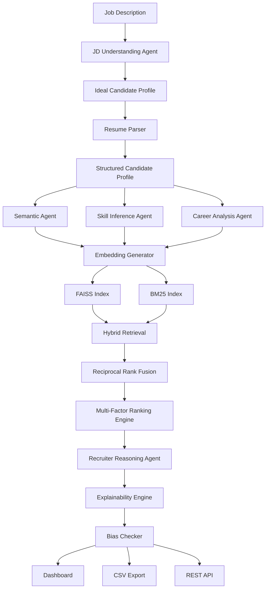

---

## AI Workflow


---

## Agent Workflow

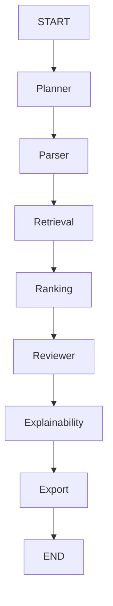

---

## Hybrid Retrieval Pipeline

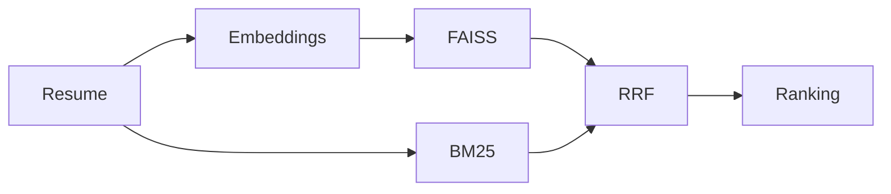

---

## Candidate Ranking Pipeline

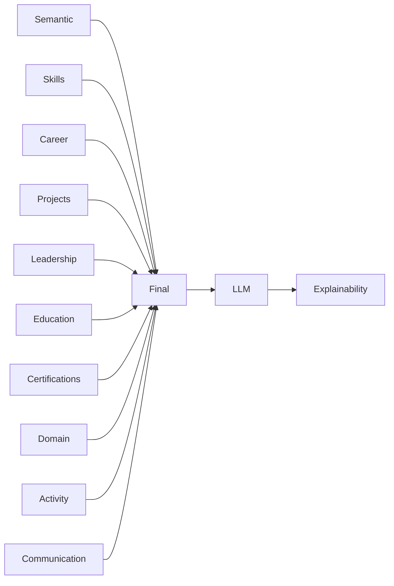

---

## Explainability Pipeline

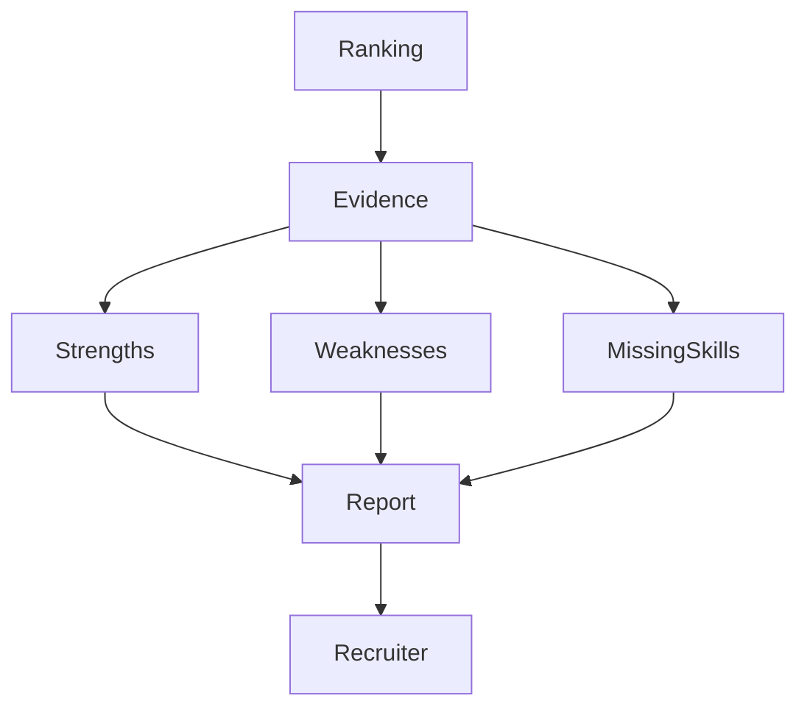

---

## Multi-Factor Candidate Evaluation

| Factor | Weight |
|----------|-------:|
| Semantic Match | 35% |
| Skill Coverage | 15% |
| Career Growth | 10% |
| Project Quality | 10% |
| Leadership | 10% |
| Education | 5% |
| Certifications | 5% |
| Domain Experience | 5% |
| Platform Activity | 5% |
| Communication | 5% |

---

## Technology Stack

| Layer | Technology |
|---------|------------|
| Frontend | Next.js 15 |
| UI | Tailwind CSS, shadcn/ui |
| Backend | FastAPI |
| Language | Python 3.11+ |
| Agent Framework | LangGraph |
| LLM | Gemini 2.5 Flash |
| Resume Parsing | Docling |
| Embeddings | BAAI/bge-large-en-v1.5 |
| Vector Search | FAISS |
| Lexical Search | BM25 |
| Ranking | Reciprocal Rank Fusion |
| Database | SQLite / PostgreSQL |
| Deployment | Docker |

---

## Repository Structure

```text
NexusHire/

├── backend/
│   ├── app/
│   │   ├── api/
│   │   ├── agents/
│   │   ├── ai/
│   │   ├── auth/
│   │   ├── core/
│   │   ├── db/
│   │   ├── explainability/
│   │   ├── models/
│   │   ├── parsers/
│   │   ├── retrieval/
│   │   ├── scoring/
│   │   ├── services/
│   │   ├── storage/
│   │   ├── utils/
│   │   └── tests/
│   │
│   ├── requirements.txt
│   └── Dockerfile
│
├── frontend/
├── docs/
├── data/
├── tests/
│
├── AI_SKILLS.md
├── DESIGN.md
├── REQUIREMENTS.md
└── README.md
```

---
---

# Installation

## Prerequisites

Before running NexusHire, ensure the following tools are installed:

| Software | Version |
|-----------|---------|
| Python | 3.11+ |
| Node.js | 20+ |
| npm / pnpm | Latest |
| Git | Latest |
| Docker *(Optional)* | Latest |

---

## Clone Repository

```bash
git clone https://github.com/<your-username>/NexusHire.git

cd NexusHire
```

---

## Backend Setup

```bash
cd backend

python -m venv .venv
```

### Windows

```bash
.venv\Scripts\activate
```

### Linux / macOS

```bash
source .venv/bin/activate
```

Install dependencies

```bash
pip install -r requirements.txt
```

Run FastAPI

```bash
uvicorn app.main:app --reload
```

Backend runs at

```
http://localhost:8000
```

---

## Frontend Setup

```bash
cd frontend

npm install
```

or

```bash
pnpm install
```

Start development server

```bash
npm run dev
```

Frontend

```
http://localhost:3000
```

---

# Docker

Build

```bash
docker compose build
```

Run

```bash
docker compose up
```

---

# Environment Variables

Create

```
backend/.env
```

Example

```env
APP_NAME=NexusHire

DEBUG=True

DATABASE_URL=sqlite:///./nexushire.db

GEMINI_API_KEY=YOUR_API_KEY

EMBEDDING_MODEL=BAAI/bge-large-en-v1.5

LLM_MODEL=gemini-2.5-flash

JWT_SECRET=CHANGE_ME

JWT_ALGORITHM=HS256

ACCESS_TOKEN_EXPIRE_MINUTES=60
```

---

# Project Workflow

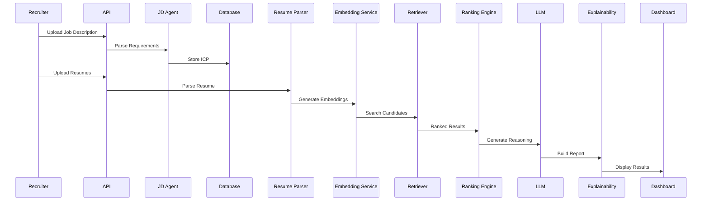

---

# Internal Processing Pipeline

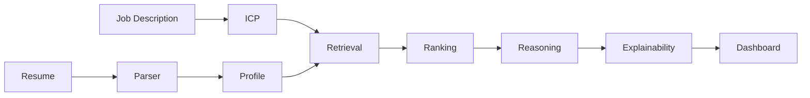

---

# LangGraph State Flow

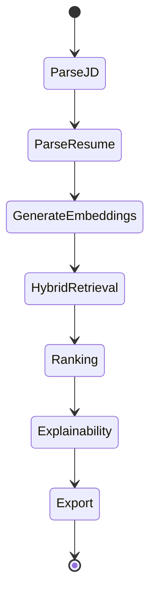

---

# REST API

## Parse Job Description

```
POST /parse-jd
```

Request

```json
{
  "title":"Machine Learning Engineer",
  "company":"Example Corp",
  "text":"Full Job Description..."
}
```

Response

```json
{
  "job_id":1,
  "confidence":0.96,
  "icp":{
    "role":"Machine Learning Engineer",
    "experience":"3-5 years",
    "required_skills":[
      "Python",
      "TensorFlow",
      "Docker"
    ]
  }
}
```

---

## Upload Resume

```
POST /upload-resume
```

Content-Type

```
multipart/form-data
```

Response

```json
{
  "resume_id":12,
  "candidate_id":4,
  "status":"parsed"
}
```

---

## Rank Candidates

```
POST /rank
```

Request

```json
{
  "job_id":1,
  "top_k":10
}
```

Response

```json
{
  "rankings":[
    {
      "candidate_id":17,
      "score":0.94,
      "confidence":0.97
    }
  ]
}
```

---

# API Summary

| Method | Endpoint | Description |
|---------|----------|-------------|
| POST | `/parse-jd` | Parse Job Description |
| POST | `/upload-resume` | Upload Resume |
| POST | `/rank` | Rank Candidates |
| GET | `/candidate/{id}` | Candidate Details |
| GET | `/dashboard` | Dashboard Data |
| GET | `/export/csv` | Export CSV |
| GET | `/export/pdf` | Export PDF |

---

# Candidate Ranking Strategy

Candidate ranking combines multiple evaluation stages.

1. Job Understanding
2. Resume Parsing
3. Semantic Retrieval
4. Hybrid Retrieval
5. Multi-Factor Ranking
6. LLM Reranking
7. Explainability

---

# Hybrid Retrieval

The retrieval engine combines dense and lexical search.

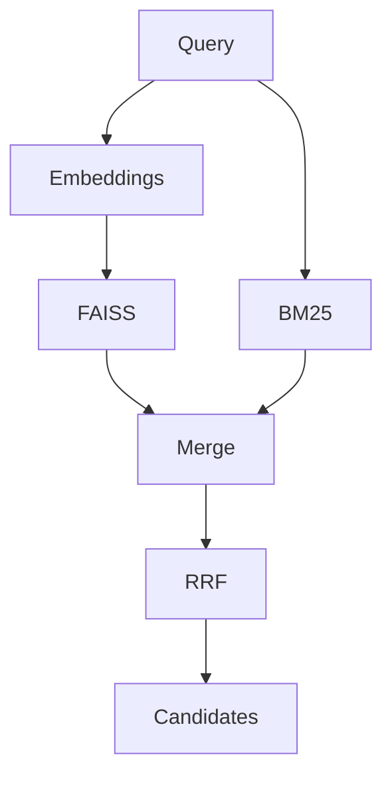

---

# Reciprocal Rank Fusion

Candidate rankings from FAISS and BM25 are merged using Reciprocal Rank Fusion.

```
Score = Σ 1 / (k + rank)
```

where

```
k = 60
```

This approach balances semantic similarity and keyword relevance while reducing ranking bias.

---

# Explainability Output

Every candidate includes a structured explanation.

```json
{
  "overall_fit":0.94,
  "confidence":0.97,
  "strengths":[
    "Strong distributed systems experience",
    "Excellent leadership history"
  ],
  "weaknesses":[
    "Limited cloud certifications"
  ],
  "missing_skills":[
    "Terraform"
  ],
  "recommendation":"Strong Hire"
}
```

---

# Security

NexusHire follows secure development practices.

- JWT Authentication
- Secure File Upload Validation
- MIME Type Validation
- Input Sanitization
- Environment Variables
- Role-Based Access Control
- Rate Limiting
- Structured Logging
- Secure Error Responses
- Bias-Aware Ranking Pipeline

---

# Performance Targets

| Metric | Target |
|---------|---------|
| Resume Parsing | <2 seconds |
| Embedding Generation | <1 second |
| Candidate Retrieval | <2 seconds |
| Ranking | <5 seconds |
| Dashboard Load | <3 seconds |
| API Response | <500 ms (excluding AI inference) |

---
---

# Repository Architecture

NexusHire follows a modular, service-oriented architecture that separates AI workflows, business logic, retrieval systems, and APIs. Each module has a single responsibility, making the platform scalable, maintainable, and easy to extend.

```text
NexusHire/

├── backend/
│   ├── app/
│   │   ├── api/
│   │   ├── agents/
│   │   ├── ai/
│   │   ├── auth/
│   │   ├── core/
│   │   ├── db/
│   │   ├── explainability/
│   │   ├── models/
│   │   ├── parsers/
│   │   ├── ranking/
│   │   ├── retrieval/
│   │   ├── schemas/
│   │   ├── services/
│   │   ├── storage/
│   │   ├── utils/
│   │   └── tests/
│   │
│   ├── requirements.txt
│   └── Dockerfile
│
├── frontend/
│
├── docs/
│
├── data/
│
├── scripts/
│
├── tests/
│
├── AI_SKILLS.md
├── DESIGN.md
├── REQUIREMENTS.md
├── README.md
└── LICENSE
```

---

# Module Responsibilities

| Module | Responsibility |
|----------|---------------|
| api | REST API endpoints |
| agents | LangGraph orchestration |
| ai | LLM wrappers & prompts |
| auth | Authentication & authorization |
| core | Configuration & startup |
| db | Database layer |
| explainability | Explainability generation |
| models | SQLModel entities |
| parsers | Resume & JD parsing |
| ranking | Candidate ranking engine |
| retrieval | Hybrid search |
| schemas | Request & response models |
| services | Business logic |
| storage | File handling |
| utils | Shared utilities |
| tests | Automated tests |

---

# AI Components

## Job Understanding Agent

Responsibilities

- Parse Job Description
- Generate Ideal Candidate Profile
- Extract required skills
- Infer preferred skills
- Estimate experience level

Input

```
Job Description
```

Output

```json
{
  "role":"Machine Learning Engineer",
  "required_skills":[
    "Python",
    "TensorFlow"
  ]
}
```

---

## Resume Parser

Responsibilities

- Parse PDF/DOCX
- Extract entities
- Normalize skills
- Build structured profile

Output

```json
{
  "skills":[],
  "projects":[],
  "companies":[],
  "education":[],
  "experience":[]
}
```

---

## Skill Inference Agent

Many resumes omit technologies the candidate clearly used.

Example

Input

```
Kubernetes
Helm
Istio
```

Output

```
Docker
Linux
Containers
DevOps
Cloud
```

---

## Career Analysis Agent

Calculates

- Career Growth
- Role Progression
- Leadership
- Domain Stability
- Experience Quality

---

## Embedding Engine

Responsible for

- Candidate Embeddings
- Job Embeddings
- Vector Index Generation

Embedding Model

```
BAAI/bge-large-en-v1.5
```

---

## Hybrid Retrieval Engine

Combines

- Semantic Retrieval
- Lexical Search
- Metadata Filtering

using

- FAISS
- BM25
- Reciprocal Rank Fusion

---

# Multi-Factor Ranking Engine

Candidate suitability is calculated using weighted evaluation factors.

| Factor | Weight |
|---------|-------:|
| Semantic Match | 35% |
| Skill Coverage | 15% |
| Career Growth | 10% |
| Project Quality | 10% |
| Leadership | 10% |
| Education | 5% |
| Certifications | 5% |
| Domain Experience | 5% |
| Platform Activity | 5% |
| Communication | 5% |

Final Score

```
Final Score

=

Σ (Weight × Factor Score)
```

---

# Candidate Ranking Workflow

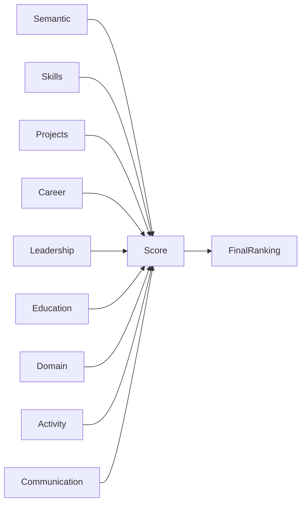

---

# Explainability Engine

The Explainability Engine provides transparent reasoning for every recommendation.

Example

```json
{
  "overall_fit":0.94,
  "confidence":0.97,

  "strengths":[
    "Excellent semantic match",
    "Strong leadership",
    "Relevant projects"
  ],

  "weaknesses":[
    "Limited AWS experience"
  ],

  "missing_skills":[
    "Terraform"
  ],

  "recommendation":"Strong Hire"
}
```

---

# Database Schema

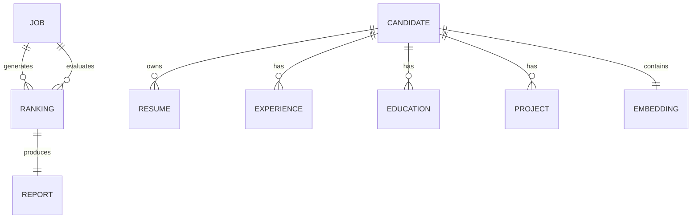

---

# Data Flow

```mermaid
flowchart TD

Resume

↓

Parser

↓

Candidate Profile

↓

Embedding

↓

Vector Database

↓

Hybrid Retrieval

↓

Ranking

↓

Explainability

↓

Dashboard
```

---

# Agent Collaboration


---

# Testing Strategy

The project includes multiple layers of testing.

| Test Type | Purpose |
|------------|----------|
| Unit Tests | Individual modules |
| Integration Tests | Service interaction |
| API Tests | REST endpoints |
| AI Evaluation | Ranking quality |
| End-to-End Tests | Complete workflow |
| Performance Tests | Response time |
| Security Tests | Authentication & uploads |

---

# Evaluation Metrics

The ranking engine is evaluated using information retrieval metrics.

| Metric | Description |
|----------|------------|
| Precision@K | Relevant candidates in top K |
| Recall@K | Relevant candidates retrieved |
| MRR | Mean Reciprocal Rank |
| NDCG@10 | Ranking quality |
| Latency | Response time |

---

# Coding Standards

The project follows:

- Clean Architecture
- SOLID Principles
- Type Hints
- Pydantic Validation
- SQLModel ORM
- Structured Logging
- Dependency Injection
- Modular Components
- Async APIs
- Comprehensive Unit Tests

Formatting

- Black
- Ruff
- MyPy

---

# CI/CD

Every commit should pass

- Formatting
- Linting
- Static Type Checking
- Unit Tests
- Integration Tests
- Security Checks

Deployment artifacts are built automatically through Docker.

---

# Deployment

Development

```
SQLite
FastAPI
Next.js
```

Production

```
PostgreSQL

FastAPI

Docker

NGINX

Railway / Render

GitHub Actions
```

---

# Development Roadmap

| Status | Feature |
|---------|----------|
| Completed | Job Description Parsing |
| Completed | Resume Parsing |
| Completed | Semantic Embeddings |
| Completed | Hybrid Retrieval |
| Completed | Multi-Factor Ranking |
| Completed | Explainability Engine |
| In Progress | Recruiter Dashboard |
| Planned | Recruiter Copilot |
| Planned | Feedback Learning |
| Planned | ATS Integration |
| Planned | Enterprise Analytics |

---

# Contributing

Contributions are welcome.

Before submitting a pull request:

1. Follow the coding standards.
2. Run all tests.
3. Update documentation.
4. Ensure formatting passes.
5. Keep modules loosely coupled.
6. Add tests for new functionality.

---

# License

This project is licensed under the MIT License.

See the `LICENSE` file for details.

---

# Acknowledgements

NexusHire is built using modern open-source technologies and AI frameworks, including:

- FastAPI
- Next.js
- LangGraph
- Gemini
- Sentence Transformers
- FAISS
- BM25
- SQLModel
- Tailwind CSS
- shadcn/ui

---

<div align="center">

## NexusHire

**Connecting Skills with Opportunity Through Intelligent AI**

Semantic Retrieval • Agentic AI • Explainable Ranking • Hybrid Search • Talent Intelligence

</div>
