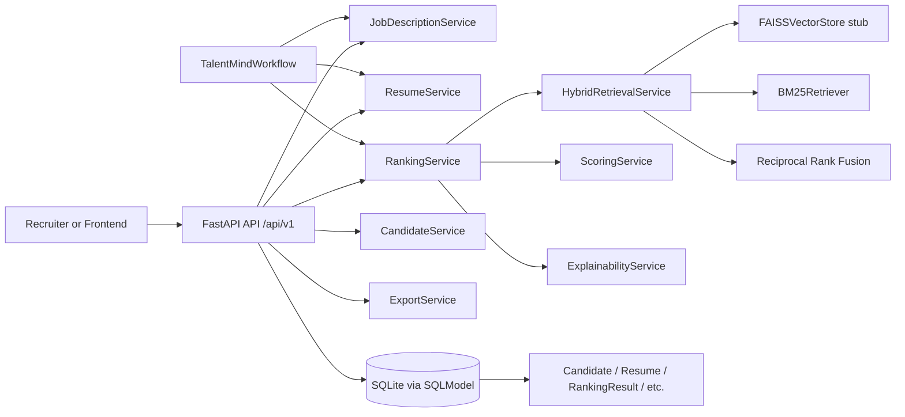
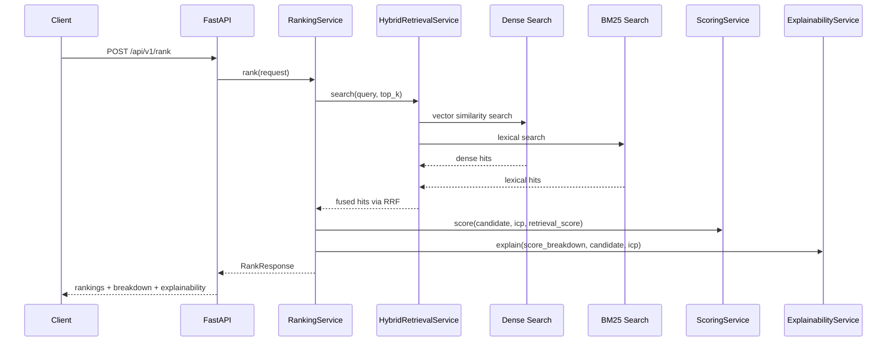
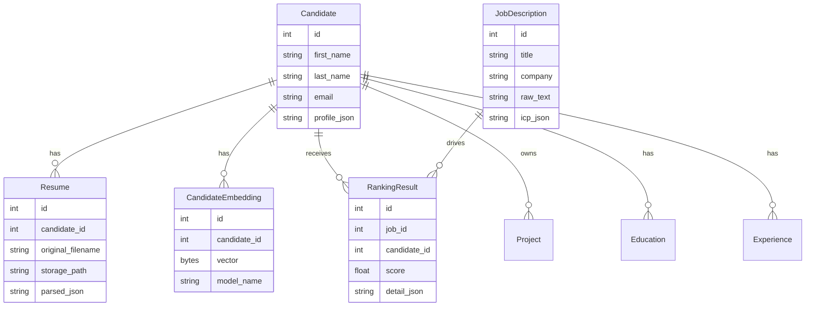

# TalentMind AI

TalentMind AI is a backend-first recruiter-assist platform for turning job descriptions and resumes into structured candidate intelligence. The current codebase focuses on a clean FastAPI foundation with deterministic job parsing, resume intake, hybrid retrieval, ranking, explainability, persistence scaffolding, and workflow orchestration stubs.

This repository is best understood as an implementation scaffold with real API contracts and tests, not a finished production product yet.

## What It Does Today

- Parses a job description into a structured ideal candidate profile (ICP)
- Accepts resume uploads and returns a parsed preview scaffold
- Indexes candidate text into dense and lexical retrieval layers
- Ranks candidates with weighted scoring and explainability output
- Exposes dashboard, candidate detail, and export metadata endpoints
- Boots SQLModel tables automatically on app startup
- Includes a typed LangGraph-style workflow plan for orchestration
- Ships with automated tests for API contracts, retrieval, scoring, workflow, and persistence

## Architecture At A Glance



## Ranking Flow



## Data Model



## Tech Stack

| Layer | Current choice |
| --- | --- |
| API | FastAPI |
| Validation | Pydantic v2 |
| Database models | SQLModel |
| Default database | SQLite (`dev.db`) |
| Dense retrieval | In-memory FAISS-style stub |
| Lexical retrieval | BM25-inspired in-memory retriever |
| Fusion | Reciprocal Rank Fusion (RRF) |
| Workflow | LangGraph-compatible scaffold |
| Testing | Pytest |

## Repository Layout

```text
.
|-- README.md
|-- ARCHITECTURE.md
|-- Requirement.md
|-- design.md
`-- backend/
    |-- requirements.txt
    |-- README.md
    `-- app/
        |-- api/               # FastAPI routes
        |-- agents/            # Workflow orchestration scaffold
        |-- core/              # Settings and app config
        |-- db/                # Engine and bootstrap helpers
        |-- explainability/    # Ranking explanation logic
        |-- models/            # SQLModel entities
        |-- repositories/      # Repository contracts + implementation
        |-- retrieval/         # Dense + lexical retrieval + RRF
        |-- schemas/           # Request/response models
        |-- scoring/           # Weighted candidate scoring
        |-- services/          # Application services
        |-- tests/             # Pytest suite
        `-- vector_store/      # In-memory vector abstraction
```

## Quick Start

### 1. Install dependencies

```bash
python -m pip install -r backend/requirements.txt
```

### 2. Start the API

```bash
uvicorn backend.app.main:app --reload
```

### 3. Open the docs

- Swagger UI: `http://127.0.0.1:8000/docs`
- ReDoc: `http://127.0.0.1:8000/redoc`

### 4. Run tests

```bash
python -m pytest backend/app/tests -q
```

## Configuration

The app reads settings from `.env` via `pydantic-settings`.

| Variable | Default | Purpose |
| --- | --- | --- |
| `APP_NAME` | `TalentMind AI` | Application name |
| `DEBUG` | `true` | Enables SQL echo / debug behavior |
| `DATABASE_URL` | `sqlite:///./dev.db` | Local database connection |
| `JWT_SECRET` | `changeme` | Placeholder auth secret |
| `VECTOR_STORE_TYPE` | `faiss` | Vector backend label used by settings |

Example `.env`:

```env
APP_NAME=TalentMind AI
DEBUG=true
DATABASE_URL=sqlite:///./dev.db
JWT_SECRET=changeme
VECTOR_STORE_TYPE=faiss
```

## API Surface

| Method | Endpoint | Purpose | Current behavior |
| --- | --- | --- | --- |
| `GET` | `/api/v1/health` | Health check | Returns `{"status": "ok"}` |
| `POST` | `/api/v1/parse-jd` | Parse job description | Builds a structured ICP from JD text |
| `POST` | `/api/v1/upload-resume` | Upload resume | Validates extension and returns a preview scaffold |
| `POST` | `/api/v1/rank` | Rank candidates | Runs hybrid retrieval, scoring, and explainability |
| `GET` | `/api/v1/candidate/{candidate_id}` | Candidate detail | Returns a deterministic sample candidate profile |
| `GET` | `/api/v1/dashboard` | Dashboard summary | Returns ranking items and aggregates for job `1` |
| `GET` | `/api/v1/export/csv` | CSV export | Returns CSV metadata only |
| `GET` | `/api/v1/export/pdf` | PDF export | Returns PDF metadata only |

## Example Requests

### Parse a job description

```bash
curl -X POST "http://127.0.0.1:8000/api/v1/parse-jd" \
  -H "Content-Type: application/json" \
  -d '{
    "title": "Backend Engineer",
    "company": "Acme",
    "text": "We need Python, FastAPI, SQLModel, BM25, and FAISS experience."
  }'
```

### Rank candidates

```bash
curl -X POST "http://127.0.0.1:8000/api/v1/rank" \
  -H "Content-Type: application/json" \
  -d '{
    "job_id": 1,
    "top_k": 3,
    "include_explainability": true,
    "filters": {
      "required_skills": ["python", "fastapi"],
      "min_experience_years": 3
    }
  }'
```

### Upload a resume

```bash
curl -X POST "http://127.0.0.1:8000/api/v1/upload-resume" \
  -F "file=@candidate_resume.pdf"
```

## Current Implementation Notes

These are important if you are evaluating the project or planning the next build steps:

- The dense retrieval layer is an in-memory FAISS-style stub, not native FAISS
- Embeddings are deterministic keyword vectors, not model-generated embeddings
- Resume parsing currently validates filename and extension, then returns a preview scaffold
- Ranking seeds a small in-memory candidate set for deterministic development behavior
- Export endpoints return file metadata, not generated CSV or PDF binaries
- The workflow compiles to LangGraph only when that dependency is installed
- `auth`, `monitoring`, `storage`, `workers`, and some AI modules are present as placeholders for future expansion

## Testing Coverage

The current test suite covers:

- Health and API contract checks
- Hybrid retrieval and reciprocal rank fusion
- Scoring and explainability behavior
- SQLModel bootstrap and repository persistence
- Workflow planning and sequential execution

Run everything with:

```bash
python -m pytest backend/app/tests -q
```

## Suggested Next Steps

If you want to take this from scaffold to production-ready system, the highest-value next steps are:

1. Replace deterministic embeddings with a real model-backed embedding service.
2. Implement actual PDF and DOCX resume parsing instead of filename-only validation.
3. Persist candidate profiles, ranking runs, and exports in the database.
4. Replace the vector stub with a real FAISS or hosted vector database integration.
5. Add authentication, audit logging, and role-based access controls.
6. Build a frontend dashboard that consumes the existing API contracts.

## Related Docs

- [backend/README.md](backend/README.md) for backend-only quickstart
- [ARCHITECTURE.md](ARCHITECTURE.md) for deeper architecture details
- [Requirement.md](Requirement.md) for the SRS
- [design.md](design.md) for design goals and planned modules
